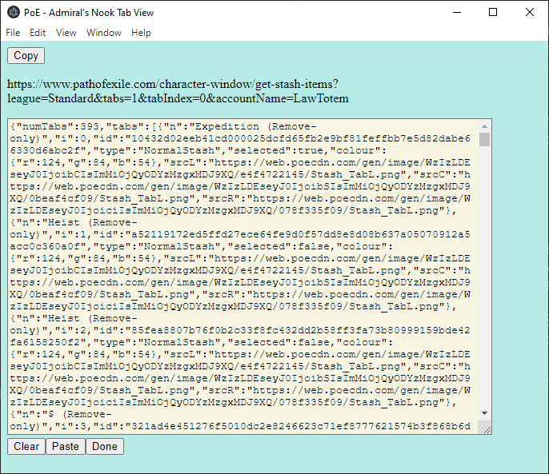

# PoE - Admiral's Nook

***This product isn't affiliated with or endorsed by Grinding Gear Games in any way.***

## About

*Ahoy there!*

Have you become so fast at hopping through portals that time spent looking through your found loot feels like standing in lava?
Maybe it's time to entrust sifting through it all to Admiral Faustus.
Just collect all your items in your stash, and when you're ready send over a catalogue.

*What have you got for me?*

I'll quickly look through your items and highlight the ones which you may want to take a close look at based on some rules we'll work on together.

*Happy Hunting!*

## Installing
 See the [Releases](github.com/LawTotem/POE-AdmiralsNook/releases).
 
 ***After installing, you will need to pick a search filename, see General Settings, and restart the application***

## Notes

1. I don't currently have a great way to add mods, so let me know if one is missing. You can see which mods were not able to be parsed by activating the developer tools in the *Tab View*
1. The way items are presented in your stash is different from the way they are presented on the PoE trade site, so some mods are searched differs.

# General Settings
 - **League**: This setting is used to create the URL used to grab the contents of your tab. It corresponds to whichever league you want to get stash tabs from, you can find it by checking the URL of Path of Exile's trade site. Navigate to the [Trade Site](pathofexile.com/trade/search), and you can change the league and check the url `pathofexile.com/trade/search/Necropolis` would be `Necropolis`.

 - **Account Name**: This setting is used to create the URL used to grab the contents of your tab. You can find it by going to the [Main Site](pathofexile.com), logging in, and click on your profile name `Logged in as #####` the URL will change to `pathofexile.com/account/view-profile/####` which is your account name.
 
 - **Search Filename**: *Changing this will require you to restart Admiral's Nook*. This is where your search setup will be saved. You can change this and restart the application if you 

 - **Dump Tab**: This setting is used to create the URL used to grab the contents of your tab. It's easy to guess this. I recommend leaving it as `0` or `1` then using the *Tab View* window to grab the tab. When you paste the contents of the tab into the window, it will parse all your tab names and you can see the tab number of your dump tab there. It will appear to the right of the tab name in square brackets `[]`.

# Search Settings

This window shows you which searches you currently have.
You can have multiple searches running at a time, and each search is broken up into subcomponents which let you customize the search.
At the lowest level, each search is made up of *Matches*. A *match* checks an item and results in a number, usually `0` if false/not or `1` if the thing is matched. *Matches* are grouped together into a *Grouping* which can be used to either *count* matches, check that all matched (*and*), check none matched (*not*). A *Search* is made up of multiple *Groupings* to make it a bit easier to construct searches, so you can re-use a *Grouping* which checks for an item type.

In the example screenshot we can see a search we are not currently editing `Corrupt Blood Jewel` at the top of the window.
The search `Dual Res Recoup Jewel` is currently being edited which reveals all the groupings it has. The first grouping `A Jewel` is not being edited, the second `Recoup` is being edited and we can see its single match, and its last `Dual Res` is not being edited. The only match in the `Recoup` grouping is to check for any mod which is `#% of Damage taken Recouped as Life`.

Each component can be toggled to `JSON` where you can view its serialized representation. These strings can be copied and pasted, so you can duplicate and potentially share.

# Tab View

Once you have all your searches setup, this window is where you can perform the stash search.
First click the `Load Tab` button to activate the copyable link.
The `Copy` button silently copies the given link, based on your general settings, so you can paste it into a browser window.
You will need to have logged into your account in that browser for the link to work, but it will load the given stash tab as a `JSON` object.
Copy all the text in the window, `Ctrl-A` selects all and `Ctrl-C` will copy, and paste it into the text block, you can use the `Paste` button at the bottom.

Press the `Done` button and it will parse the given tab, searching and highlighting each item which matches a search. The layout should match the given tab. Hovering over the item will give you the name and the list of searches which matched.

To see more information on the item you can click any item in the window and it will open an *Item View* window with more information on the item.

# Item View

As simple view of the item, in case you are not in the game.

